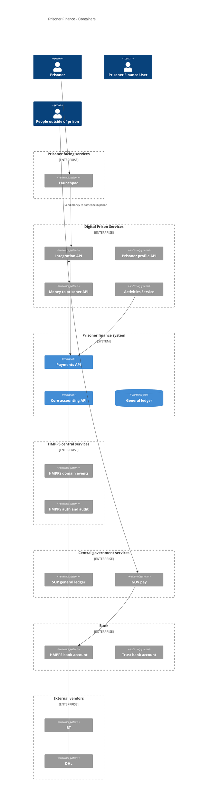

```mermaid
C4Container
    title Prisoner Finance - Containers

    Person(Prisoner, "Prisoner")
    Person(PrisonerFinanceUser, "Prisoner Finance User")
    Person(MtpUsers, "People outside of prison")

    Enterprise_Boundary("Shops_boundary", "Prisoner facing services") {
        System_Ext(Launchpad, "Launchpad")
    }
    
    Enterprise_Boundary("DPS_boundary", "Digital Prison Services") {
        System_Ext(IntegrationAPI, "Integration API")
        System_Ext(PrisonerProfileAPI, "Prisoner profile API")
        System_Ext(MoneyToPrisonerAPI, "Money to prisoner API")
        System_Ext(ActivitiesService, "Activities Service")
    }

    System_Boundary("PrisonerFinanceSystem", "Prisoner finance system") {
        Container(PaymentsApi, "Payments API")
        Container(CoreAccounting, "Core accounting API")
        ContainerDb(GeneralLedgerDB, "General ledger")
    }

    Enterprise_Boundary("DPSBoundary", "HMPPS central services") {
        System_Ext(DpsPrisonerEvents, "HMPPS domain events")
        System_Ext(HMPPSAuth, "HMPPS auth and audit")
    }
    
    Enterprise_Boundary("CentralGovernmentServices", "Central government services") {
        System_Ext(Sop, "SOP general ledger")
        System_Ext(GovPay, "GOV pay")
    }
 
    Enterprise_Boundary("Bank", "Bank") {
        System_Ext(HMPPSBankAccount, "HMPPS bank account")
        System_Ext(TrustBankAccount, "Trust bank account")
    }

    Enterprise_Boundary("ExternalVendors_boundary", "External vendors") {
        System_Ext(BTService, "BT")
        System_Ext(DHLService, "DHL")
    }

    Rel(Prisoner, Launchpad,  "")
    Rel(Launchpad, IntegrationAPI, "")
    Rel(IntegrationAPI, PaymentsApi,  "")

    Rel(MtpUsers, MoneyToPrisonerAPI, "Send money to someone in prison") 
    Rel(MoneyToPrisonerAPI, GovPay, "")
    Rel(GovPay, HMPPSBankAccount, "")

    
    Rel(ActivitiesService, PaymentsApi, "")

    Rel(BTService, IntegrationAPI, "")
    Rel(DHLService, IntegrationAPI, "")
    

    UpdateLayoutConfig($c4ShapeInRow="3", $c4BoundaryInRow="1")
```
