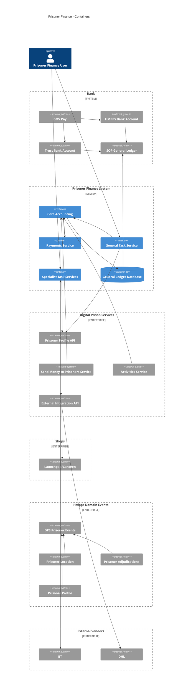

```mermaid
C4Container
    title Prisoner Finance - Containers

    Person(PrisonerFinanceUser, "Prisoner Finance User")
    
    System_Boundary("Bank", "Bank") {

        System_Ext(GovPay, "GOV Pay")
        System_Ext(HMPPSBankAccount, "HMPPS Bank Account")
        System_Ext(TrustBankAccount, "Trust Bank Account")
        System_Ext(SOPGeneralLedger, "SOP General Ledger")
    }

    System_Boundary("PrisonerFinanceSystem", "Prisoner Finance System") {
        Container(CoreAccounting, "Core Accounting")
        Container(PaymentsService, "Payments Service")
        Container(GeneralTaskService, "General Task Service")
        Container(SpecialistTaskServices, "Specialist Task Services")
        ContainerDb(GeneralLedgerDB, "General Ledger Database")
    }
    
    Enterprise_Boundary("DPS_boundary", "Digital Prison Services") {
        System_Ext(PrisonerProfileAPI, "Prisoner Profile API")
        System_Ext(SendMoneyService, "Send Money to Prisoners Service")
        System_Ext(ActivitiesService, "Activities Service")
        System_Ext(ExternalIntegrationAPI, "External Integration API")
    }

    Enterprise_Boundary("Shops_boundary", "Shops") {
        System_Ext(LaunchpadCanteen, "Launchpad/Canteen")
    }

    Enterprise_Boundary("DPSBoundary", "Hmpps Domain Events") {
        System_Ext(DpsPrisonerEvents, "DPS Prisoner Events")
        System_Ext(PrisonerLocation, "Prisoner Location")
        System_Ext(PrisonerAdjudications, "Prisoner Adjudications")
        System_Ext(PrisonerProfileData, "Prisoner Profile")
    }

    Enterprise_Boundary("ExternalVendors_boundary", "External Vendors") {
        System_Ext(BTService, "BT")
        System_Ext(DHLService, "DHL")
    }

    Rel(PrisonerFinanceUser, GeneralTaskService, "")
    Rel(PrisonerFinanceUser, SpecialistTaskServices, "")
    Rel(SendMoneyService, CoreAccounting, "")
    Rel(ActivitiesService, CoreAccounting, "")
    Rel(PrisonerProfileAPI, CoreAccounting, "")
    Rel(GeneralTaskService, CoreAccounting, "")
    Rel(SpecialistTaskServices, CoreAccounting, "")
    Rel(CoreAccounting, PaymentsService, "")
    Rel(PaymentsService, CoreAccounting, "")
    Rel(PaymentsService, ExternalIntegrationAPI, "")
    Rel(ExternalIntegrationAPI, LaunchpadCanteen, "")
    Rel(ExternalIntegrationAPI, BTService, "")
    Rel(ExternalIntegrationAPI, DHLService, "")
    Rel(CoreAccounting, GeneralLedgerDB, "")
    Rel(GeneralLedgerDB, SOPGeneralLedger, "")
    Rel(GovPay, HMPPSBankAccount, "")
    Rel(GovPay, TrustBankAccount, "")
    Rel(HMPPSBankAccount, SOPGeneralLedger, "")
    Rel(TrustBankAccount, SOPGeneralLedger, "")
    Rel(TrustBankAccount, SOPGeneralLedger, "")
    Rel(PrisonerLocation, DpsPrisonerEvents, "")
    Rel(PrisonerAdjudications, DpsPrisonerEvents, "")
    Rel(PrisonerProfileData, DpsPrisonerEvents, "")
    Rel(DpsPrisonerEvents, SpecialistTaskServices, "")
    Rel(GeneralTaskService, PrisonerProfileAPI, "")
    Rel(SpecialistTaskServices, PrisonerProfileAPI, "")

    UpdateLayoutConfig($c4ShapeInRow="3", $c4BoundaryInRow="1")
```
