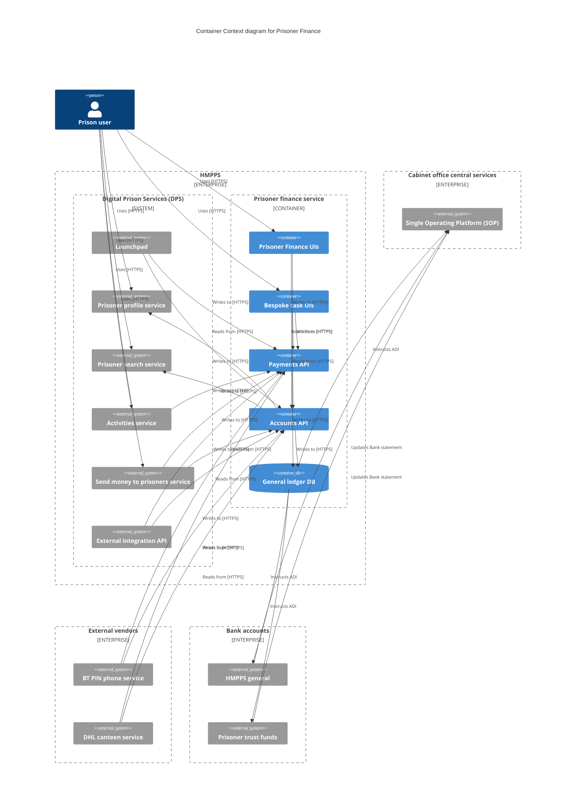

# getting started

From the root of this repository run the following command to start the structurizr lite web service.

```shell
make serve-structurizer
```

this will create a web service available at `http://localhost:8080` which will allow you to explore the workspace.

## Exporting to Mermaid

Mermaid code can be used in Github Markdown so to export views to mermaid run the following docker command;

```shell
make export-c4-mermaid
```
## Exporting to PlantUML

To export views to PlantUML run the following docker command;

```shell
make export-c4-plantuml
```

# Architecture

